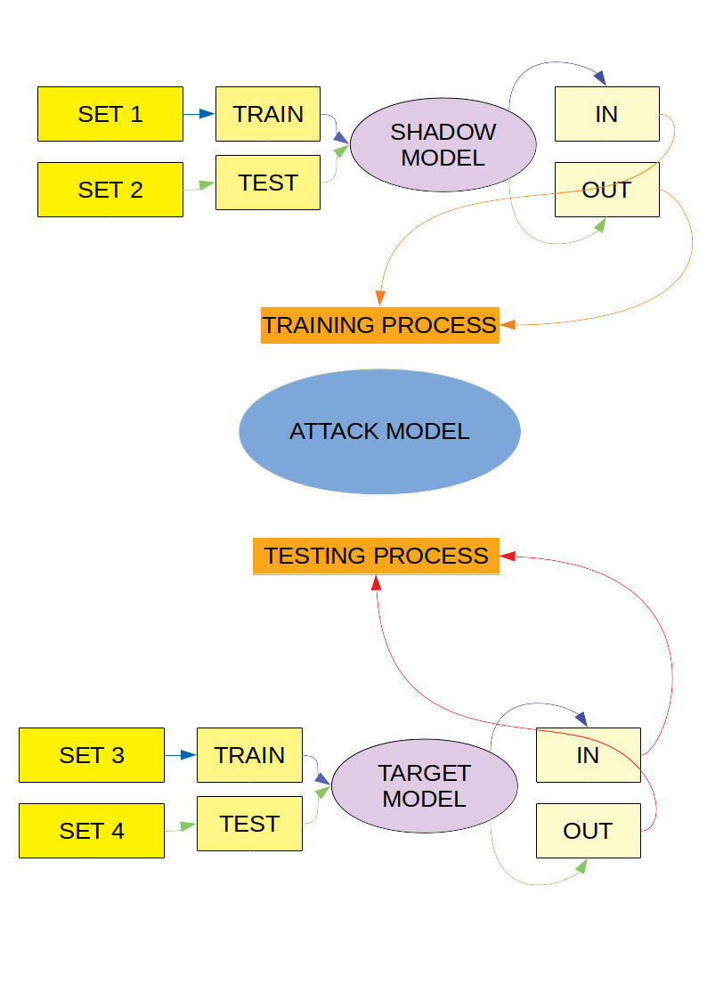

# Membership Inference Attack :ML
## GNR 652 Course Project
- Devak Sinha (180070017)
- G. Vamsi (180070020)
- Rohan Jasani (180070025)
- Lalit Saini (180070030)
---
### Introduction :
Membership inference attack tries to find a data point's membership in a training dataset. 
It predicts whether a data point was present in the dataset used to train a model. It can help to leak valuable information
from a ML model. This attack is a major threat to machine learning Api present in the market. This attack take adavantage of
overfit in the model. To know more about this refer 
This project is implementation of this paper [ML Leaks](https://arxiv.org/pdf/1806.01246.pdf).

---
### How it works :

### Using :
Clone the repository to your local and follow the given steps.

**Installing Requirements**

We recommend using `Python 3.x` and virtual environment is preferable.

`pip install -r Requirements.txt`

Run the jupyter server in the project's repository.

`jupyter notebook --browser <your favourite browser>`

Now run the **Shadow_Softmax.ipynb** and **Target_RandomForest.ipynb**.
Observe the training and testing accuracy. There is a lot of difference between them, which means the *target model* is overfitting the data making it vulenrable to our attack.

Now run the attack with **Attack_Model.ipynb**. Here you will see the accuracy of the *Logistic Regression attack model* which is indication of the percentage of data we were able to classify as the member of the training set of our *target model*.

> Note: In case you encounter memory error. Run everything again after allocating more memory or run on another system

**Test Train split visulisation**

